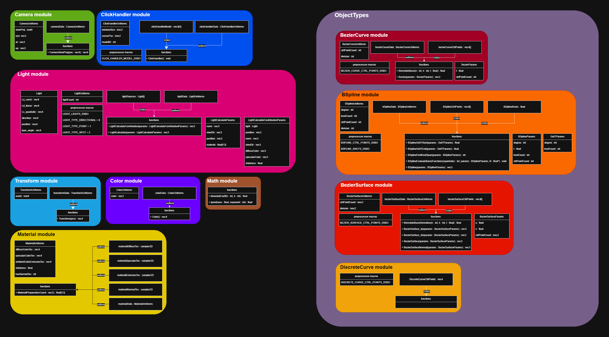

# Shader Modules Documentation

## Shader Module Structure and Conventions

To ensure efficient inclusion and usage of shader modules, each module is organized into separate files. This design allows only the necessary components to be loaded when a module is used. All modules adhere to the following conventions:

### 1. Module File Structure
Each module consists of **two files**:

- **`[module]_uniforms.glsl`** – Contains all uniforms, buffers, and preprocessor macros required for the module to function.  
  - If a uniform is a non-primitive type, its definition is included in this file.

- **`[module].glsl`** – Contains the module’s functions.  
  - If a function’s parameters or return type are non-primitive types, their definitions are included here.

### 2. Buffer Binding Conventions
If a module uses any buffers, the corresponding **binding points must be defined as preprocessor macros**. This ensures consistency and allows easy configuration when including the module in shaders.

---

## Table of Contents

- [BezierCurve Module](#beziercurve-module)
- [BezierSurface Module](#beziersurface-module)
- [BSpline Module](#bspline-module)
- [Camera Module](#camera-module)
- [ClickHandler Module](#clickhandler-module)
- [Color Module](#color-module)
- [DiscreteCurve Module](#discretecurve-module)
- [Light Module](#light-module)
- [Material Module](#material-module)
- [Math Module](#math-module)
- [Transform Module](#transform-module)

---

## BezierCurve Module

The **BezierCurve** module generates points along a Bézier curve based on the control points provided in an SSBO and a division value.  

### Functionality
- The module uses the **closed-form calculation** with the Bernstein basis.  
- The **basis function** can also be called independently.  
- This module depends on the **Math** module (`Math.glsl`).

### Include path
- `./ObjectTypes/BezierCurve/BezierCurve_uniforms.glsl`
- `./ObjectTypes/BezierCurve/BezierCurve.glsl`

### Structs
**BezierCurveUniforms**
- ctrlPointCount : int
- division : int

**BezierParams**
- ctrlPointCount : int
- t : float

### Uniform Instances
- `bezierCurveData` : `BezierCurveUniforms`

### Functions
- `BernsteinBase(n : int, k : int, t : float) : float`
- `Bezier(params : BezierParams) : vec3`

### Preprocessor Macros
- `BEZIER_CURVE_CTRL_POINTS_SSBO`

---

## BezierSurface Module

The **BezierSurface** module generates a surface using the provided control points and division values.  
The surface is constructed as a **tensor-product Bézier surface**, formed by Bézier curves across both dimensions.

### Functionality
- Generates a Bézier surface from a 2D grid of control points.  
- Requires the number of control points and division values in **both dimensions**, provided as `ivec2`.  
- Includes functions for computing surface normals, which are useful for lighting and shading.
- This module depends on the **BezierCurve** module (`BezierCurve.glsl`), but does not includes its uniforms.

### Include path
- `./ObjectTypes/BezierSurface/BezierSurface_uniforms.glsl`
- `./ObjectTypes/BezierSurface/BezierSurface.glsl`

### Structs
**BezierSurfaceUniforms**
- ctrlPointCount : ivec2
- division : ivec2

**BezierSurfaceParams**
- u : float
- v : float
- ctrlPointCount : ivec2

### Uniform Instances
- `bezierSurfaceData` : `BezierSurfaceUniforms`

### Functions
- `BernsteinBaseDerivative(n : int, k : int, t : float) : float`
- `BezierSurface_du(params : BezierSurfaceParams) : vec3`
- `BezierSurface_dv(params : BezierSurfaceParams) : vec3`
- `BezierSurface(params : BezierSurfaceParams) : vec3`
- `BezierSurfaceNormal(params : BezierSurfaceParams) : vec3`

### Preprocessor Macros
- `BEZIER_SURFACE_CTRL_POINTS_SSBO`

---

## BSpline Module

The **BSpline** module generates points along a B-spline curve based on the control points and knot vector provided in an SSBO, as well as a division value.  

### Functionality
- Supports curves of up to **degree 10**.  
- This maximum degree can be increased by modifying a configuration in the source code.  

### Include path
- `./ObjectTypes/BSpline/BSpline_uniforms.glsl`
- `./ObjectTypes/BSpline/BSpline.glsl`

### Structs
**BSplineUniforms**
- degree : int
- knotCount : int
- ctrlPointCount : int
- division : int

**BSplineParams**
- degree : int
- t : float
- knotCount : int
- ctrlPointCount : int

**GetTParams**
- degree : int
- knotCount : int

### Uniform Instances
- `bSplineData` : `BSplineUniforms`

### Functions
- `BSplineGetTStart(params : GetTParams) : float`
- `BSplineGetTEnd(params : GetTParams) : float`
- `BSplineFindKnotSpan(params : BSplineParams) : int`
- `BSplineEvaluateBasisFunctions(spanIndex : int, params : BSplineParams, N : float[]) : void`
- `BSpline(params : BSplineParams) : vec3`

### Preprocessor Macros
- `BSPLINE_CTRL_POINTS_SSBO`
- `BSPLINE_KNOTS_SSBO`

---

## Camera Module

The **Camera** module transforms vertices from world space into screen space.

### Include path
- `./Camera/Camera_uniforms.glsl`
- `./Camera/Camera.glsl`

### Structs
**CameraUniforms**
- viewProj : mat4
- at : vec3
- up : vec3
- eye : vec3

### Uniform Instances
- `cameraData` : `CameraUniforms`

### Functions
- `CameraViewProj(pos : vec4) : vec4`

---

## ClickHandler Module

The **ClickHandler** module enables models to be clickable. When included in a fragment shader, it writes the ID of the model currently under the cursor into a buffer.  

### Buffer Requirements
The module expects a buffer consisting of **two `vec4` elements**:

- The **first `vec4`** stores the corresponding model IDs for each element.  
- The **second `vec4`** contains unused data and should not be read, but it is **required for the module to function correctly**.

### Usage
Calling the `ClickHandler` function in the main shader function performs all necessary operations to track clickable models.

### Notes
- This module performs an **early depth test**.  
- It is therefore **not compatible** with techniques such as per-pixel displacement mapping.

### Include path
- `./ClickHandler/ClickHandler_uniforms.glsl`
- `./ClickHandler/ClickHandler.glsl`

### Structs
**ClickHandlerUniforms**
- windowSize : ivec2
- cursorPos : ivec2
- modelID : int

### Uniform Instances
- `clickHandlerData` : `ClickHandlerUniforms`

### Functions
- `ClickHandler() : void`

### Preprocessor Macros
- `CLICK_HANDLER_MODEL_SSBO`

---

## Color Module

The **Color** module is a simple utility.  
The `Color()` function returns the color provided through its uniform.

### Include path
- `./Color/Color_uniforms.glsl`
- `./Color/Color.glsl`

### Structs
**ColorUniforms**
- color : vec3

### Uniform Instances
- `colorData` : `ColorUniforms`

### Functions
- `Color() : vec4`

---

## DiscreteCurve Module

The **DiscreteCurve** module renders a polyline that passes through the points provided in an SSBO.

### Include path
- `./ObjectTypes/DiscreteCurve/DiscreteCurve_uniforms.glsl`
- `./ObjectTypes/DiscreteCurve/DiscreteCurve.glsl`

### Preprocessor Macros
- `DISCRETE_CURVE_CTRL_POINTS_SSBO`

---

## Light Module

The **Light** module is responsible for computing the illumination of each model.  
It reads light sources from an SSBO and evaluates the color of each fragment using the **Blinn–Phong lighting model**.

### Functionality

- The `LightCalculate` function expects the material data of the model as a `float[13]` array. This array must follow the exact layout produced by the `MaterialPrepare` function from the **Material** module.
- Additionally, preprocessor macros can be used to define which numeric identifiers correspond to each light source type in the SSBO.

### Include path
- `./Light/Light_uniforms.glsl`
- `./Light/Light.glsl`

### Structs
**Light**
- La_const : vec4
- Ld_linear : vec4
- Ls_quadratic : vec4
- direction : vec4
- position : vec4
- type_angle : vec4

**LightCalculateContributionParams**
- light : Light
- position : vec3
- norm : vec3
- viewDir : vec3
- diffuseColor : vec3
- specularColor : vec3
- shininess : float

**LightCalculateParams**
- norm : vec3
- viewDir : vec3
- position : vec3
- material : float[13]
  - \[0-2\]:  ambient color
  - \[3-5\]:  diffuse color
  - \[6-8\]:  specular color
  - \[9-11\]: emission color
  - \[12\]: shininess

**LightUniforms**
- lightCount : int

### Uniform Instances
- `lightData` : `LightUniforms`

### Functions
- `LightCalculateContribution(params : LightCalculateContributionParams) : vec3`
- `LightCalculate(params : LightCalculateParams) : vec3`

### Preprocessor Macros
- `LIGHT_LIGHTS_SSBO`
- `LIGHT_TYPE_DIRECTIONAL = 0`
- `LIGHT_TYPE_POINT = 1`
- `LIGHT_TYPE_SPOT = 2`

---

## Material Module

The **Material** module handles receiving and preparing a model's material for use by the **Light** module, including texturing.

### Functionality
- The `MaterialPrepare()` function returns data in a layout that matches exactly what the `LightCalculate()` function in the **Light** module expects.

### Include path
- `./Material/Material_uniforms.glsl`
- `./Material/Material.glsl`

### Structs
**MaterialUniforms**
- diffuseColorTex : vec4
- specularColorTex : vec4
- ambientColorEmissionTex : vec4
- shininess : float
- hasNormalTex : int

### Uniform Instances
- `materialDiffuseTex` : `sampler2D`
- `materialSpecularTex` : `sampler2D`
- `materialEmissionTex` : `sampler2D`
- `materialNormalTex` : `sampler2D`
- `materialData` : `MaterialUniforms`

### Functions
- MaterialPrepare(texCoord : vec2) : float[13]
  - \[0-2\]:  ambient color
  - \[3-5\]:  diffuse color
  - \[6-8\]:  specular color
  - \[9-11\]: emission color
  - \[12\]: shininess

---

## Math Module

The **Math** module does not use any uniforms, so the `Math_uniforms.glsl` file does not exist.  
This module is simple and provides utility functions, primarily to support computations related to the Bernstein basis.

### Include path
- `./Math.glsl`

### Functions
- `binomialCoeff(n : int, k : int) : float`
- `ipow(base : float, exponent : int) : float`

## Transform Module

The **Transform** module is responsible for positioning the model within the scene.  

### Structs
**TransformUniforms**
- world : mat4

### Uniform Instances
- `transformData` : `TransformUniforms`

### Functions
- `Transform(pos : vec4) : vec4`

---
